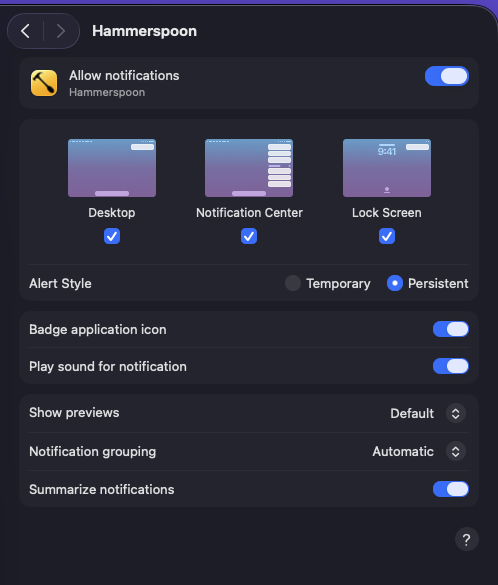

# dotfiles

Ghostty + tmux + zsh + Starship + eza + zoxide setup for macOS with smart terminal notifications.

> **Tab terminology:** "tab" means a tmux window throughout — Ghostty native tabs aren't available in the quick terminal.

## What you get

**Persistent tmux session**
Ghostty always attaches to (or creates) a session named `main`. Works in the quick terminal. Set `NO_AUTO_TMUX=1` to skip.

**Smart auto-save**
Snapshots save automatically every 30 seconds via a background loop that starts with Ghostty and runs as long as tmux is alive. Only one loop runs at a time. Green text appears in the status bar for 5 seconds after each save instead of the default resurrect banner.

**Restore picker**
On a fresh Ghostty launch when tmux is not running, an fzf picker shows recent saves grouped by type:

```
Restore tmux? >
> auto    2m ago
  auto    35m ago
  manual  1h ago
  new session
```

If the quick terminal and a regular Ghostty window open simultaneously, both show the picker; whichever you answer first wins and the other dismisses automatically.

**Status bar save times**
The top-right of the status bar shows the age of the last auto and manual save:

```
auto: 3m ago  manual: 1h ago
```

**Long-running command notifications**
Any command taking longer than 3 seconds triggers a macOS notification when it finishes. The notification title shows the command name; clicking it focuses Ghostty and jumps to the tmux tab where it ran. Threshold is configurable via `TERMINAL_ALERT_MIN_SECONDS`.

**Claude and Codex notifications**
Both send notifications when they need attention, finish a turn, or hit a rate/token limit.

| Trigger | Claude | Codex |
|---------|--------|-------|
| Turn done | ✓ hook (`Stop`) | ✓ hook (`Stop`) |
| Asks a question | ✓ hook (`PreToolUse`) | ✓ stateful polling |
| Permission prompt | ✓ hook (`PermissionRequest`) | ✓ stateful polling |
| Elicitation / MCP | ✓ hook (`Elicitation`) | ✗ (Codex has no MCP support) |
| Rate / token limit | ✓ hook (`StopFailure`) | ✓ stateful polling |

Claude's `StopFailure` hook fires on any API error (rate limit, token limit, billing, etc.) and sends **"hit an error :("**. Codex detects limits via a stateful tmux-pane watcher and sends **"ran out of tokens :("** only on new blocking states.

The `codex` shell wrapper automatically passes `-c features.codex_hooks=true`. Both `claude/settings.json` and `codex/hooks.json` are included and set up by the installer. tmux-resurrect is configured to relaunch `claude` and `codex` panes after restore.

**Tab attention indicator**
When a notification fires, a 🔔 appears in the status bar for that tab and a persistent macOS notification is shown. Both clear together under the same conditions:

| Event | Bell clears | Notification clears |
|-------|-------------|---------------------|
| Switch to the tab (keyboard or clicking the tab in the status bar) | ✓ | ✓ |
| Switch away from the tab (notification fired while you were already on it) | ✓ | ✓ |
| Focus any pane in the tab | ✓ | ✓ |
| Start typing in the tab | ✓ | ✓ |
| Click into Ghostty from another app while already on the tab | ✓ | ✓ |
| Click the macOS notification | ✓ | ✓ (switches to the tab) |
| Close the tab | n/a | ✓ |
| Detach from tmux | ✓ all | ✓ all |

**Tab auto-rename**
The tab title updates to the currently running command and resets to `zsh` when it finishes.

**Starship prompt**
A powerline-style prompt with colored segments on the left and right:

- **Left**: directory (blue) → git branch (orange) → git status (green)
- **Right**: command duration (orange, only when ≥2s) → current time (purple)

Git segments only appear inside a git repo. The status segment only appears when there are uncommitted changes or the branch is ahead/behind its remote.

```
 ~/Projects/dotfiles   better-notif-contents   !?      3s   02:34 PM
❯
```

Prompt config lives in `starship/starship.toml`. Requires the [JetBrainsMono Nerd Font](https://www.nerdfonts.com) for icons — install with `brew install --cask font-jetbrains-mono-nerd-font`.

**Directory listing**
`ls` is aliased to `eza --icons`, showing folder and file icons using Nerd Font glyphs.

**Shell autosuggestions**
As you type, a faded suggestion appears based on your command history. Press Tab, Right arrow, or `Ctrl+E` to accept the full suggestion, `Ctrl+F` to accept one word at a time.

**fzf key bindings**
- `Ctrl+R` — fuzzy search command history; type to filter, Enter to run
- `Ctrl+T` — fuzzy search files in the current directory tree; Enter to insert the path
- `Alt+C` — fuzzy search subdirectories and cd into the selection

**Smart cd**
`cd` is replaced by zoxide — frecency-based directory jumping. `cd foo` works as normal; `cd foo` with a partial name jumps to the most frequent match.

Pressing Tab after `cd ` or `z ` opens an fzf picker showing subdirectories with the same icons as `ls`. Typing filters the list; Enter inserts the selection. Works with partial paths too — `cd Pro` + Tab filters to directories matching "Pro".

## Requirements

- macOS
- [Homebrew](https://brew.sh) — install manually
- zsh (macOS default)

The following are installed automatically by `install.sh`:

- [Ghostty](https://ghostty.org)
- [Hammerspoon](https://www.hammerspoon.org)
- [tmux](https://github.com/tmux/tmux)
- [Starship](https://starship.rs)
- [eza](https://github.com/eza-community/eza)
- [zoxide](https://github.com/ajeetdsouza/zoxide)
- [fzf](https://github.com/junegunn/fzf)
- [zsh-autosuggestions](https://github.com/zsh-users/zsh-autosuggestions)
- [JetBrainsMono Nerd Font](https://www.nerdfonts.com)

## Install

```bash
git clone https://github.com/jasoncaserta/dotfiles.git ~/Projects/dotfiles
cd ~/Projects/dotfiles
./install.sh
```

`./install.sh` installs the **follower** setup by default.

Use leader mode explicitly:

```bash
./install.sh --leader
```

**Leader** — sets up full symlinks so edits to your dotfiles (e.g. `~/.zshrc`) write directly into the repo. Just commit and push. `git pull` on any other machine picks up changes immediately.

**Follower** — never touches your existing config files. Appends include directives alongside your existing settings. For Claude and Codex hooks it merges only events not already defined. Re-running is safe — all steps are idempotent.

To get updates as a follower: `git pull && ./install.sh`. Behavior changes are picked up by `git pull` alone; new features require re-running `install.sh`.

## Post-install

**1. Hammerspoon permissions**

Open System Settings → Privacy & Security and grant Hammerspoon:
- Accessibility
- Notifications

Then reload: Hammerspoon menu bar icon → Reload Config.

**2. Hammerspoon notification style**

Open System Settings → Notifications → Hammerspoon and set Alert Style to **Persistent**. This keeps notifications on screen until you switch to the relevant tab (or dismiss them manually).



**3. Reload tmux** (inside an active tmux session)

```bash
tmux source ~/.tmux.conf
~/.tmux/plugins/tpm/bin/install_plugins
```

**4. Restart your shell** or open a new Ghostty window for zsh changes to take effect.

After a reboot, open Ghostty and use the restore picker to choose a snapshot or start a new session.

## Customization

| Variable | Default | Description |
|----------|---------|-------------|
| `TERMINAL_ALERT_MIN_SECONDS` | `3` | Minimum runtime before a done notification fires |
| `NO_AUTO_TMUX` | unset | Set to any value to skip auto-attach to tmux on Ghostty launch |
| `HISTFILE` | `~/.zsh_history` | Path to the zsh history file |
| `HISTSIZE` / `SAVEHIST` | `100000` | Number of history entries kept in memory and on disk |

Export these in `~/.zprofile` to change the defaults.

## Key bindings

Run `jason help` in a shell to print these key bindings in the terminal.

### Ghostty

| Binding | Action |
|---------|--------|
| <code>Cmd+`</code> | Toggle quick terminal (global) |
| `Ctrl+Tab` | Next tmux tab |
| `Ctrl+Shift+Tab` | Previous tmux tab |
| `Cmd+T` | New tmux tab |
| `Cmd+W` | Close tmux tab |
| `Cmd+Enter` | Toggle fullscreen |
| `Cmd+Shift+Enter` | Zoom current split |
| `Cmd+D` | New split right |
| `Cmd+Shift+D` | New split down |
| `Cmd+[` | Previous split |
| `Cmd+]` | Next split |
| `Cmd+F` | Search scrollback |
| `Cmd+K` | Clear screen |

### tmux

tmux prefix is `Ctrl-A`.

| Binding | Action |
|---------|--------|
| `prefix \|` | Split horizontal |
| `prefix -` | Split vertical |
| `prefix h/j/k/l` | Navigate panes (vim-style) |
| `prefix r` | Reload tmux config |
| `prefix Ctrl-s` | Save tmux snapshot manually |
| `prefix Ctrl-r` | Restore tmux snapshot manually |
| `M-Left / M-Right` | Previous / next tab |
| `Middle-click status bar` | Kill clicked tab |

Mouse text selection is overridden so that releasing the mouse copies to clipboard without scrolling to the bottom of the pane. Press `Escape` or `q` to exit copy mode and return to the bottom.
